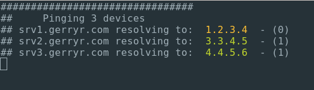

# vping
Visual Ping, a python utility to monitor multiple ping results

The requirement for this stems for some work we had to do with some internal devices, needed to monitor a large amount of CNAME changes and take certain actions once they all resolved to their new IP.

The idea is for future such sessions we can have the script running against the list of devices and have it dynamically update as the changes take effect.

* add list of items to be pinged to the `ping.txt` file.
* run the `vping.py` script.
* terminal output will keep updating as the devices update.
* `ctrl + c` to quit out of.

## Notes
* Currently only runs on Linux as there are some OS specific commands
* There's a while loop set to 100 runs to prevent the script running indefinitely
* At the moment once an IP changes it goes green, if for some reason it changes again it will stay green, this is not an issue for my current use case although I have added a counter to highlight multiple changes.

